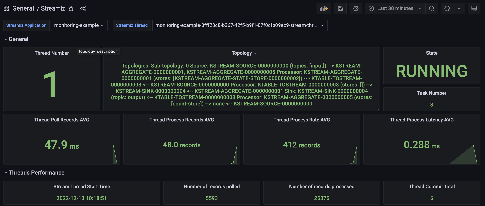

# kafka-streams-dotnet-samples

Demo applications and code examples for [Streamiz](https://github.com/LGouellec/kafka-streams-dotnet), the .NET Stream Processing Library for Apache Kafka 🚀

|                              **_Example_**                             |           **Instructions**           | **Produce mock data**                                                                                                                                                                                                                                                                                                                                                                                                                                                                                                                                                                                                                                                                                                                                                                                                                                                                                                                                                                                                                                                                                                                                                                                                                                                                                                                                                                                                                                                                                                                                                                                                                                                                                       |                                                                                                                                                            **Expected**                                                                                                                                                            |                             **Comment**                             |
|:----------------------------------------------------------------------:|:------------------------------------:|-------------------------------------------------------------------------------------------------------------------------------------------------------------------------------------------------------------------------------------------------------------------------------------------------------------------------------------------------------------------------------------------------------------------------------------------------------------------------------------------------------------------------------------------------------------------------------------------------------------------------------------------------------------------------------------------------------------------------------------------------------------------------------------------------------------------------------------------------------------------------------------------------------------------------------------------------------------------------------------------------------------------------------------------------------------------------------------------------------------------------------------------------------------------------------------------------------------------------------------------------------------------------------------------------------------------------------------------------------------------------------------------------------------------------------------------------------------------------------------------------------------------------------------------------------------------------------------------------------------------------------------------------------------------------------------------------------------|:----------------------------------------------------------------------------------------------------------------------------------------------------------------------------------------------------------------------------------------------------------------------------------------------------------------------------------:|:-------------------------------------------------------------------:|
| Global KTable                                                          | ./run-example.sh -e global-ktable    | seq -f "1\|{\"name\": \"iPhone %g\", \"id\": 1}" 10 10 \| docker exec -i schema-registry kafka-avro-console-producer --bootstrap-server broker:29092 --property schema.registry.url=http://localhost:8081 --topic product --property value.schema='{"type":"record","name":"Product","namespace":"com.dotnet.samples.avro","fields":[ {"name":"id","type":"int"},{"name":"name","type":"string"} ]}' --property parse.key=true --property key.separator=\| --property key.serializer=org.apache.kafka.common.serialization.StringSerializer   seq -f "1\|{\"name\": \"Customer %g\", \"id\": 1}" 1 1 \| docker exec -i schema-registry kafka-avro-console-producer --bootstrap-server broker:29092 --property schema.registry.url=http://localhost:8081 --topic customer --property value.schema='{"type":"record","name":"Customer","namespace":"com.dotnet.samples.avro","fields":[ {"name":"id","type":"int"},{"name":"name","type":"string"} ]}' --property parse.key=true --property key.separator=\| --property key.serializer=org.apache.kafka.common.serialization.StringSerializer   for i in {1..3}; do echo "${i}\|{\"productId\": 1, \"id\": ${i}, \"customerId\": 1}";done \| docker exec -i schema-registry kafka-avro-console-producer --bootstrap-server broker:29092 --property schema.registry.url=http://localhost:8081 --topic order --property value.schema='{"type":"record","name":"Order","namespace":"com.dotnet.samples.avro","fields":[ {"name":"id","type":"int"},{"name":"customerId","type":"int"},{"name":"productId","type":"int"} ]}' --property parse.key=true --property key.separator=\| --property key.serializer=org.apache.kafka.common.serialization.StringSerializer | (Order can differed) 2 : {"productName":"iPhone 10","productId":1,"customerName":"Customer 1","customerId":1,"orderId":2} 3 : {"productName":"iPhone 10","productId":1,"customerName":"Customer 1","customerId":1,"orderId":3} 1 : {"productName":"iPhone 10","productId":1,"customerName":"Customer 1","customerId":1,"orderId":1 | #globalKtable #stateful #joinStreamGlobalKTable                     |
| Stateless map application                                              | ./run-example.sh -e map-function     | seq -f "key:value%g" 10 \| docker exec -i broker kafka-console-producer --bootstrap-server broker:29092 --topic text-lines-topic --property parse.key=true --property key.separator=:                                                                                                                                                                                                                                                                                                                                                                                                                                                                                                                                                                                                                                                                                                                                                                                                                                                                                                                                                                                                                                                                                                                                                                                                                                                                                                                                                                                                                                                                                                                       | key : VALUE1 key : VALUE2 key : VALUE3  key : VALUE4  key : VALUE5 key : VALUE6 key : VALUE7  key : VALUE8  key : VALUE9   key : VALUE10                                                                                                                                                                                           | #stateless #map #map-values                                         |
| Stateful sum application (Sum 1 + 2 + 3 + 4 + 5  + 6 + 7 + 8 + 9 + 10) | ./run-example.sh -e sum              | seq -f "%g" 10 \| docker exec -i broker kafka-console-producer --bootstrap-server broker:29092 --topic numbers-topic --property parse.key=false                                                                                                                                                                                                                                                                                                                                                                                                                                                                                                                                                                                                                                                                                                                                                                                                                                                                                                                                                                                                                                                                                                                                                                                                                                                                                                                                                                                                                                                                                                                                                             | 1 : 1 1 : 3 1 : 6 1 : 10 1 : 15 1 : 21 1 : 28 1 : 36 1 : 45 1 : 55                                                                                                                                                                                                                                                                 | #sum #stateful #reduce #groupBy                                     |
| Stateful word count application                                        | ./run-example.sh -e word-count       | for i in {1..10}; do echo key:value;done \| docker exec -i broker kafka-console-producer --bootstrap-server broker:29092 --topic plaintext-input --property parse.key=true --property key.separator=:                                                                                                                                                                                                                                                                                                                                                                                                                                                                                                                                                                                                                                                                                                                                                                                                                                                                                                                                                                                                                                                                                                                                                                                                                                                                                                                                                                                                                                                                                                       | value : 1 value : 2 value : 3 value : 4 value : 5 value : 6 value : 7 value : 8 value : 9 value : 10                                                                                                                                                                                                                               | #count #stateful #flatMapValues #groupBy                            |
| Stateful page view application                                         | ./run-example.sh -e page-view-region | echo "User1\|{\"user\": \"User1\", \"region\": \"usa-central\"}\nUser2\|{\"user\": \"User2\", \"region\": \"usa-west\"}\nUser3\|{\"user\": \"User3\", \"region\": \"france\"}" \| docker exec -i schema-registry kafka-avro-console-producer --bootstrap-server broker:29092 --property schema.registry.url=http://localhost:8081 --topic user-profiles --property value.schema='{"type":"record","name":"UserProfile","namespace":"com.dotnet.samples.avro","fields":[  {"name":"user","type":"string"},{"name":"region","type":"string"} ]}' --property parse.key=true --property key.separator=\| --property key.serializer=org.apache.kafka.common.serialization.StringSerializer   echo "User1\|{\"user\": \"User1\", \"url\": \"https://www.google.com\"}\nUser2\|{\"user\": \"User2\", \"url\": \"https://www.amazon.com\"}\nUser3\|{\"user\": \"User3\", \"url\": \"https://www.myshop.com\"}" \| docker exec -i schema-registry kafka-avro-console-producer --bootstrap-server broker:29092 --property schema.registry.url=http://localhost:8081 --topic page-views --property value.schema='{"type":"record","name":"PageView","namespace":"com.dotnet.samples.avro","fields":[  {"name":"user","type":"string"},{"name":"url","type":"string"} ]}' --property parse.key=true --property key.separator=\| --property key.serializer=org.apache.kafka.common.serialization.StringSerializer                                                                                                                                                                                                                                                                                                         | (Order and time can differed) Key : france Window : Start time : 12/07/2022 08:40:00 \| End time : 12/07/2022 08:45:00  : 1 Key : usa-central Window : Start time : 12/07/2022 08:40:00 \| End time : 12/07/2022 08:45:00  : 1 Key : usa-west Window : Start time : 12/07/2022 08:40:00 \| End time : 12/07/2022 08:45:00  : 1     | #join #leftJoin #stateful #AVRO #windowing                          |
| Monitoring streamiz application                                        | ./run-example.sh -e monitoring       | curl -s -X PUT \        -H "Content-Type: application/json" \       --data '{                 "connector.class": "io.confluent.kafka.connect.datagen.DatagenConnector",                 "kafka.topic": "input",                 "max.interval": 5,                 "quickstart": "pageviews",                 "tasks.max": "1",                 "transforms": "ValueToKey,ExtractField",                 "transforms.ValueToKey.type": "org.apache.kafka.connect.transforms.ValueToKey",                 "transforms.ValueToKey.fields": "userid",                 "transforms.ExtractField.type": "org.apache.kafka.connect.transforms.ExtractField$Key",                 "transforms.ExtractField.field": "userid"             }' \       http://localhost:8083/connectors/datagen-pageviews/config                                                                                                                                                                                                                                                                                                                                                                                                                                                                                                                                                                                                                                                                                                                                                                                                                                                                                                       | Go to http://localhost:3000 (Login : admin / Password : password). Visit the Streamiz dashboard present in the collection                                                                                                                                                                                                          | #monitoring #openTelemetry #prometheus #grafana #streamizDashboard  |

# EXAMPE MAP FUNCTION
seq -f "key:value%g" 10 | docker exec -i broker kafka-console-producer --bootstrap-server broker:29092 --topic text-lines-topic --property parse.key=true --property key.separator=:

EXPECTED
key : VALUE1
key : VALUE2
key : VALUE3
key : VALUE4
key : VALUE5
key : VALUE6
key : VALUE7
key : VALUE8
key : VALUE9
key : VALUE10

# EXAMPLE WORD COUNT 

for i in {1..10}; do echo key:value;done | docker exec -i broker kafka-console-producer --bootstrap-server broker:29092 --topic plaintext-input --property parse.key=true --property key.separator=:

EXPECTED
value : 1
value : 2
value : 3
value : 4
value : 5
value : 6
value : 7
value : 8
value : 9
value : 10

# EXAMPLE SUM

seq -f "%g" 10 | docker exec -i broker kafka-console-producer --bootstrap-server broker:29092 --topic numbers-topic --property parse.key=false

EXPECTED : 
1 : 1
1 : 3
1 : 6
1 : 10
1 : 15
1 : 21
1 : 28
1 : 36
1 : 45
1 : 55

# EXAMPE GLOBAL-KTABLE

Product
seq -f "1|{\"name\": \"iPhone %g\", \"id\": 1}" 10 10 | docker exec -i schema-registry kafka-avro-console-producer --bootstrap-server broker:29092 --property schema.registry.url=http://localhost:8081 --topic product --property value.schema='{"type":"record","name":"Product","namespace":"com.dotnet.samples.avro","fields":[{"name":"id","type":"int"},{"name":"name","type":"string"}]}' --property parse.key=true --property key.separator=\| --property key.serializer=org.apache.kafka.common.serialization.StringSerializer

Customer
seq -f "1|{\"name\": \"Customer %g\", \"id\": 1}" 1 1 | docker exec -i schema-registry kafka-avro-console-producer --bootstrap-server broker:29092 --property schema.registry.url=http://localhost:8081 --topic customer --property value.schema='{"type":"record","name":"Customer","namespace":"com.dotnet.samples.avro","fields":[{"name":"id","type":"int"},{"name":"name","type":"string"}]}' --property parse.key=true --property key.separator=\| --property key.serializer=org.apache.kafka.common.serialization.StringSerializer

Publish an order
for i in {1..3}; do echo "${i}|{\"productId\": 1, \"id\": ${i}, \"customerId\": 1}";done | docker exec -i schema-registry kafka-avro-console-producer --bootstrap-server broker:29092 --property schema.registry.url=http://localhost:8081 --topic order --property value.schema='{"type":"record","name":"Order","namespace":"com.dotnet.samples.avro","fields":[{"name":"id","type":"int"},{"name":"customerId","type":"int"},{"name":"productId","type":"int"}]}' --property parse.key=true --property key.separator=\| --property key.serializer=org.apache.kafka.common.serialization.StringSerializer

EXPECTED (Order can differed)
2 : {"productName":"iPhone 10","productId":1,"customerName":"Customer 1","customerId":1,"orderId":2}
3 : {"productName":"iPhone 10","productId":1,"customerName":"Customer 1","customerId":1,"orderId":3}
1 : {"productName":"iPhone 10","productId":1,"customerName":"Customer 1","customerId":1,"orderId":1

# EXAMPE PAGE-VIEW-REGION

Customer
echo "User1|{\"user\": \"User1\", \"region\": \"usa-central\"}\nUser2|{\"user\": \"User2\", \"region\": \"usa-west\"}\nUser3|{\"user\": \"User3\", \"region\": \"france\"}" | docker exec -i schema-registry kafka-avro-console-producer --bootstrap-server broker:29092 --property schema.registry.url=http://localhost:8081 --topic user-profiles --property value.schema='{"type":"record","name":"UserProfile","namespace":"com.dotnet.samples.avro","fields":[{"name":"user","type":"string"},{"name":"region","type":"string"}]}' --property parse.key=true --property key.separator=\| --property key.serializer=org.apache.kafka.common.serialization.StringSerializer

Publish an page view
echo "User1|{\"user\": \"User1\", \"url\": \"https://www.google.com\"}\nUser2|{\"user\": \"User2\", \"url\": \"https://www.amazon.com\"}\nUser3|{\"user\": \"User3\", \"url\": \"https://www.myshop.com\"}" | docker exec -i schema-registry kafka-avro-console-producer --bootstrap-server broker:29092 --property schema.registry.url=http://localhost:8081 --topic page-views --property value.schema='{"type":"record","name":"PageView","namespace":"com.dotnet.samples.avro","fields":[{"name":"user","type":"string"},{"name":"url","type":"string"}]}' --property parse.key=true --property key.separator=\| --property key.serializer=org.apache.kafka.common.serialization.StringSerializer

EXPECTED (Order and time can differed)
Key : france
Window : Start time : 12/07/2022 08:40:00 | End time : 12/07/2022 08:45:00
 : 1
Key : usa-central
Window : Start time : 12/07/2022 08:40:00 | End time : 12/07/2022 08:45:00
 : 1
Key : usa-west
Window : Start time : 12/07/2022 08:40:00 | End time : 12/07/2022 08:45:00
 : 1

# EXAMPLE MONITORING

curl -s -X PUT \
      -H "Content-Type: application/json" \
      --data '{
                "connector.class": "io.confluent.kafka.connect.datagen.DatagenConnector",
                "kafka.topic": "input",
                "max.interval": 5,
                "quickstart": "pageviews",
                "tasks.max": "1",
                "transforms": "ValueToKey,ExtractField",
                "transforms.ValueToKey.type": "org.apache.kafka.connect.transforms.ValueToKey",
                "transforms.ValueToKey.fields": "userid",
                "transforms.ExtractField.type": "org.apache.kafka.connect.transforms.ExtractField$Key",
                "transforms.ExtractField.field": "userid"
            }' \
      http://localhost:8083/connectors/datagen-pageviews/config | jq